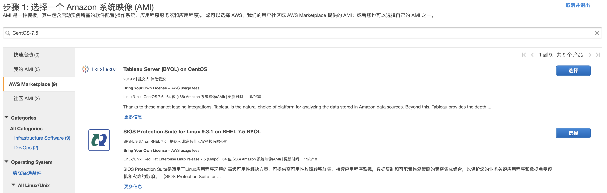
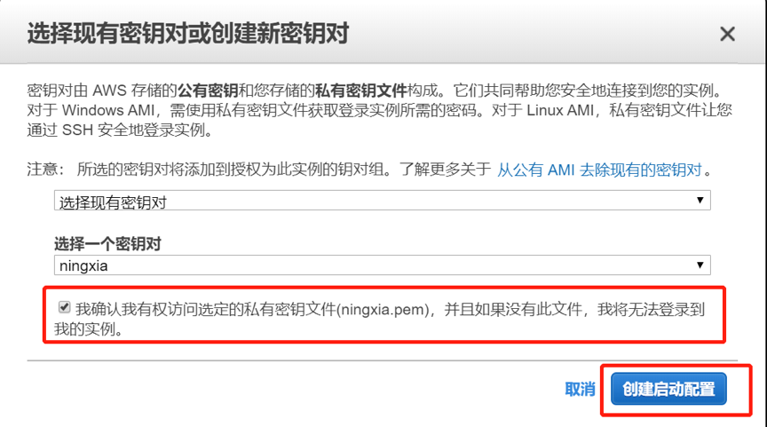
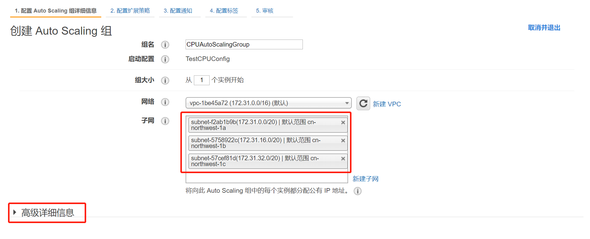

# 基于CPU指标的AutoScaling 

### Step 0. 订阅CentOS

在下面的实验中会用到 centos ， 需要先到AWS Marketplace中订阅一下。 



选择 CentOS-7.5.1804-Nitro， 然后启动这个AMI


创建负载均衡器
-------------------------------

### Step 1. 打开EC2控制台

点击  **服务**  ->   **计算**  ->  **EC2** 


### Step 2. 打开负载均衡器

在EC2控制台左边导航栏，点击**负载均衡器**


### Step 3. 创建负载均衡器

点击**创建负载均衡器**


根据需要创建不同类型的负载均衡器类型，这里选择**应用程序负载均衡器**。


### Step 4. 配置负载均衡器

在名称输入框中输入合适的名称，这里输入*TestCPUAutoScaling*。
配置端口80， （如果没有申请ICP Exception，可以先设置其他端口。）


可用区选择，选择3个可用区，选择子网时，需要选择公网。然后点击“下一步：配置安全设置”


### Step 5. 配置安全设置

如果在上一步没有配置HTTPS，这里直接点击“**下一步：配置安全组**”


### Step 6. 配置安全组

分配安全组选择创建一个新安全组。在安全组名称中输入“web”，描述输入“web to all”，下面规则保持默认即可。然后点击“下一步：配置路由”

如果没有做ICP  Exception ， 需要做做申请， 否则80端口无法打开。 


### Step 7. 配置路由

目标组保持选中“新建目标组”，名称输入*TestCPUGroup*，其他保持默认，点击“**下一步：注册目标**”。


### Step 8. 注册目标

暂时不用注册，点击“下一步：**审核**”


### Step 9. 审核确认

审核页面确认信息无误后，点击创建。


创建启动配置组
-------------------------------


### Step 10. 创建启动配置

在EC2控制台左侧点击“AutoScaling”下的“启动配置”，然后在右边面板点击“创建启动配置”


### Step 11. 选择AMI

根据自身需要，选择对应的AMI，本文这里选择*TestCPUAutoScaling*，点击“选择”按钮


### Step 12. 选择实例类型

根据业务需要，选择合适的实例大小，本文为方便演示，选择*t2.micro*，然后点击“下一步：**配置详细信息**”。


### Step 13. 配置详细信息

在名称输入框中输入便于区分的名称：TestCPUConfig。根据自身需要选择是否启用CloudWatch详细监控（注意：启用CloudWatch详细监控，需要收费）。点击“下一步：添加存储”。


### Step 14. 添加存储

根据业务需要可修改或添加新卷，然后点击“下一步：配置安全组”。


### Step 15. 配置安全组

选择“创建一个新安全组”，安全组名称和描述都输入“AllowALB”，在规则类型选择“HTTP”，来源选择“自定义IP”，在输入框中输入“sg”，然后选择名称为web的安全组，再点击“审核”


### Step 16. 审核并创建启动配置

确认相关信息无误后，点击“创建启动配置”


### Step 17. 选择或新建密钥对

如果是新建，需要保存密钥到本地。选择对应的密钥后，勾选上“我确认我有权访问选定的私有密钥文件(ningxia.pem)，并且如果没有此文件，我将无法登录到我的实例。”，然后点击“创建启动配置”。



创建AutoScaling组
-------------------------------


### Step 18. 准备创建AutoScaling组

在EC2控制台左侧点击“AutoScaling”下的“AutoScaling组”，然后在右边面板上点击“创建AutoScaling组”


### Step 19. 选择启动配置

滚动到页面下半部分，选择之前创建的启动配置，然后点击“下一步”。


### Step 20. 配置AutoScaling组详细信息

在组名输入框中输入合适的组名：CPUAutoScalingGroup。组大小保持从1个实例开始。在子网选择中，选择3个子网。




点击 **高级详细信息**，展开详细信息配置。选中“从一个或多个负载均衡器接收流量”，然后点击“目标组”输入框，选择 **TestCPUGroup** ，根据自身需要选择是否“启用CloudWatch详细监控”。然后点击“下一步：配置扩展策略”。


### Step 21. 配置扩展策略

选择“使用扩展策略调整此组的容量”，根据自身业务调整上限和下限，这里选择在1和3个实例之间进行扩展。在扩展组大小，目标组输入合适的比例，生产环境可设置为70或80，这里演示输入70。然后点击“审核”。


### Step 22. 审核并创建AutoScaling组

确认无误后，点击“创建AutoScaling组”。


请确认下图 Auto Scaling Group 已经和目标组进行了关联


测试
-------------------------------


### Step 23. 访问首页

在EC2控制台左边导航栏，点击负载均衡器，在后边控制面板，点击 TestCPUAutoScaling，在描述中DNS名称为该ALB的地址，
复制该地址，在浏览器中打开，该地址类似 ：TestCPUAutoScaling-31879283.cn-northwest-1.elb.amazonaws.com.cn。
```shell script
#复制下面链接到浏览器打开
http://'your-alb-dns'/ip
```


### Step 24. 加压

在Linux服务器上执行以下代码：
```shell script
while true; do wget -q -O - http://'your-alb-url'/cacl; done
```

把地址替换为ALB的DNS名称。正常输出OK


### Step 25. 观察AutoScaling组大小

在EC2控制台左边导航栏，点击AutoScaling组，可以看到CPUAutoScalingGroup组大小会变为3。


### Step 26.查看负载均衡器负载分发

在浏览器中输入ALB的DNS名称加/ip，例如
```shell script
    http://'your-alb-dns'/ip
```
 

可以看到每次显示的IP不同（该IP为EC2的内网IP）。


### Step 27. 释放压力

在Linux服务上按Ctrl+C，中断循环，释放压力。


### Step 28. 再次观察AutoScaling组大小

释放压力后，过5分钟，组大小会调整为1。


 


